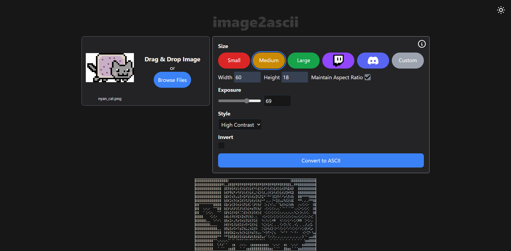

⢀⣶⣦⠀⠀⠀⠀⠀⠀⠀⠀⠀⠀⠀⠀⠀⠀⠀⠀⠀⠀⠀⠀⠀⠀⠀⠀⠀⠀⠀⠀⠀⠀⠀    ⣠⣤⣤⣤⡀⠀⠀⠀⠀⠀⠀⠀⠀⠀⠀⠀⠀⠀⠀⠀⠀⠀⠀    ⢰⣶⡄⢠⣶⣦
⠀⣙⣋⠀⣀⣀⡀⣀⣄⡀⢀⣠⣀⠀⠀⣀⣠⣄⣀⠀⠀⢀⣠⣀⢀⣀⡀⠀⢀⣀⣤⣀⠀⠀⠟⠉⠙⣿⣿⠀ ⢀⣀⣠⣀⡀⠀⠀⣀⣠⣄⡀⠀⠀⣀⣠⣄⡀⢈⣛⡁⢈⣙⣋
⠀⣿⣿⠀⣿⣿⡟⢻⣿⣿⠛⢿⣿⡆⠀⢛⣉⣻⣿⡇⢠⣿⣿⠛⢿⣿⡇⢠⣿⡟⠉⣿⣧⠀⠀⣠⣼⣿⠟⠀⠘⢋⣉⣻⣿⡆⢰⣿⣟⣉⠃⢀⣾⣿⠟⠛⠇⢸⣿⡇⢸⣿⣿
⠀⣿⣿⠀⣿⣿⡇⢸⣿⣿⠀⢸⣿⡇⢸⣿⡋⣹⣿⡇⢸⣿⣧⣀⣼⣿⡇⠸⣿⣿⡛⢛⡛⠀⣾⣿⣯⣤⣤⠀⣼⣿⡉⣹⣿⡇⢀⡉⢛⣿⣷⠘⣿⣿⣄⣀⡀⢸⣿⡇⢸⣿⣿
⠀⠛⠛⠀⠛⠛⠃⠘⠛⠛⠀⠘⠛⠃⠘⠻⠛⠙⠛⠃⠀⠙⠻⠛⣹⣿⡇⠀⠙⠛⠿⠛⠃⠀⠛⠛⠛⠛⠛⠀⠘⠻⠛⠙⠛⠃⠘⠛⠟⠛⠁⠀⠈⠛⠿⠛⠃⠘⠛⠃⠘⠛⠛
⠀⠀⠀⠀⠀⠀⠀⠀⠀⠀⠀⠀⠀⠀⠀⠀⠀⠀⠀⠀⠀    ⢿⣶⣾⠿⠟⠀⠀⠀⠀⠀⠀⠀⠀⠀⠀⠀⠀⠀⠀⠀⠀⠀⠀⠀⠀⠀⠀⠀⠀⠀⠀⠀⠀⠀⠀⠀⠀⠀⠀⠀⠀⠀

# [image2ascii](https://image2ascii.com/)

Convert your PNG and JPEG images into customizable ASCII art. Create perfect ASCII for Twitch and Discord with preset sizes, dithering styles, and more.

## Features

- Convert images into ASCII art with customizable settings: size, style, exposure, & inversion
- Presets for Twitch & Discord
- Support for PNG, JPEG, JPG
- User-friendly, responsive interface

## Screenshots

**Creating Twitch ASCII Art**


**Dark Mode**



**Responsive Design**


## Installation

### Prerequisites
- [Go 1.23.X](https://go.dev/dl/)
- [Node.js 18.x or higher](https://nodejs.org/en/download)
- npm 9.x or higher (comes with Node.js)

### Local Development

```bash
# Clone the repository
git clone https://github.com/tony-montemuro/image2ascii

# Navigate to project directory
cd image2ascii

# Install dependencies
go mod download
npm i

# Start the development server
go run app.go

# In a separate terminal, start the Tailwind build process
npx tailwindcss -i ./static/input.css -o ./static/styles.css --watch
